<h1>Anitsuki - Anime İzleme Platformu</h1>
<h1>Giriş</h1>
<h4>Anitsuki, anime severler için tasarlanmış açık kaynaklı bir platformdur. Kullanıcılar, animeleri kolayca izleyebilir, önizleme videoları ile karar verebilir ve kişisel listelerle deneyimlerini kişiselleştirebilir. 
Bu proje, modern web teknolojileri kullanılarak geliştirilmiştir ve topluluk katkısına açıktır.</h4>

<h1>Özellikler</h1>
Anitsuki'yi Diğer Platformlardan Ayıran Benzersiz Özellikler

- **Karar Öncesi Önizleme Videosu**  
  - Her anime için **30 saniyelik özel önizleme** izleyin.  
  - "Bu anime bana göre mi?" sorusuna **anında cevap** alın.  
  - Zaman kaybını **tamamen önleyin**.

- **"Hemen Karar Ver" Sistemi**  
  - Önizleme sonrası **tek tıkla** seçim yapın:  
    - ✅ **Hemen İzle**  
    - ⏰ **Daha Sonra İzle**  
    - ❤️ **Favorilere Ekle**  
  - Tüm seçenekler **tek ekranda**, karmaşasız arayüz.

- **Kişisel Anime Panosu**  
  - Hesap açtığınızda size özel **kontrol merkezi** aktif olur:  
    - İzleme listeleri ve **ilerleme çubukları**  
    - Beğeni / beğenmeme **istatistikleri**  
    - Tüm **yorumlarınız**  
  - Her şey **düzenli ve sade** bir sayfada.

- **Duygu Butonları (Beğen / Beğenme)**  
  - Sadece "beğendim" değil, **"beğenmedim"** de diyebilirsiniz.  
  - Topluluğun **gerçek beğeni oranı** ortaya çıkar.  
  - Sahte pozitiflik **yok**.

- **Yorum + Duygu Entegrasyonu**  
  - Yazdığınız yoruma otomatik olarak **beğeni/beğenme ikonu** eklenir.  
  - Diğer kullanıcılar **hem fikrinizi okur**, hem de **duygusal tepkinizi görür**.

- **"Keşfetmeden Önce Bil" Felsefesi**  
  - Rastgele izleme **yerine bilinçli seçim**.  
  - **Önizleme + topluluk geri bildirimi** ile **en doğru animeyi** bulun.

  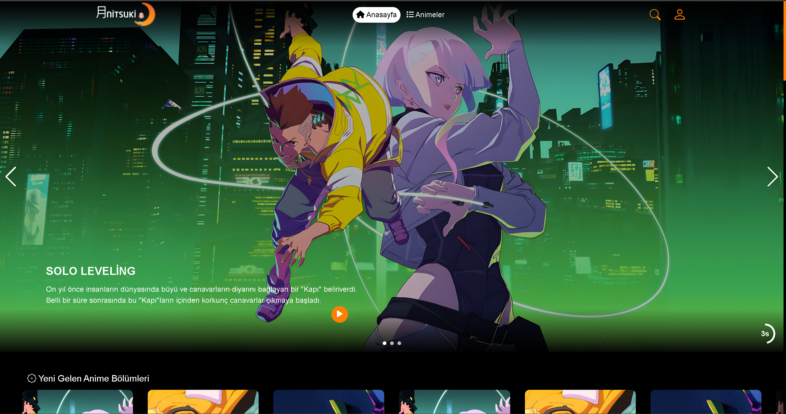
  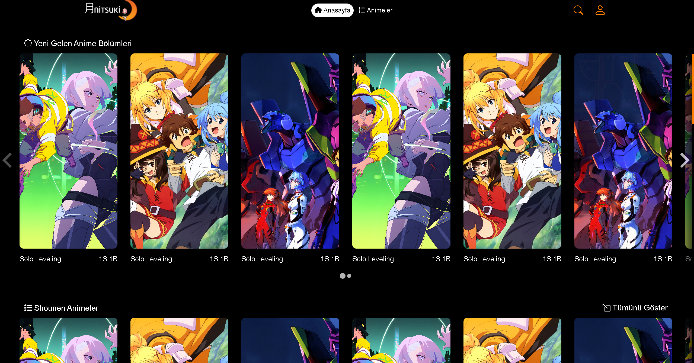
  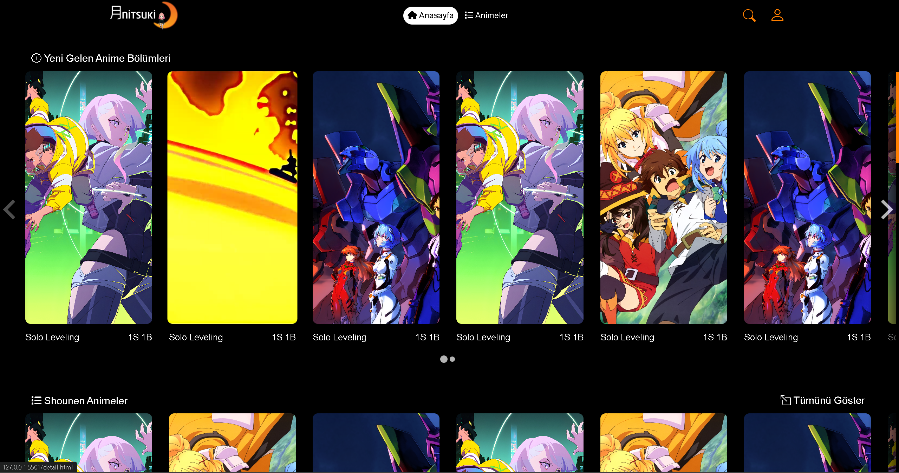
  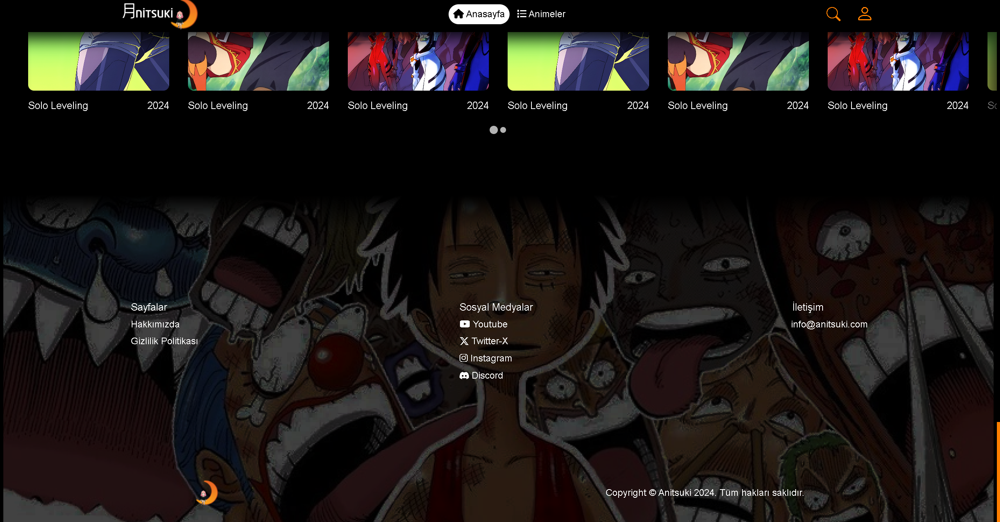
  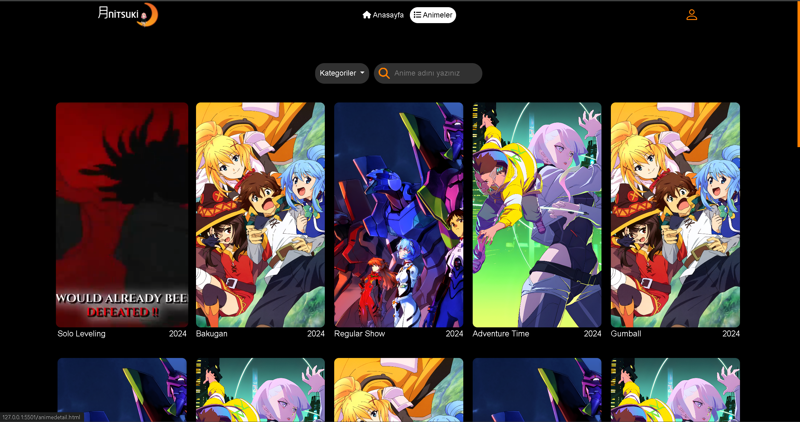
  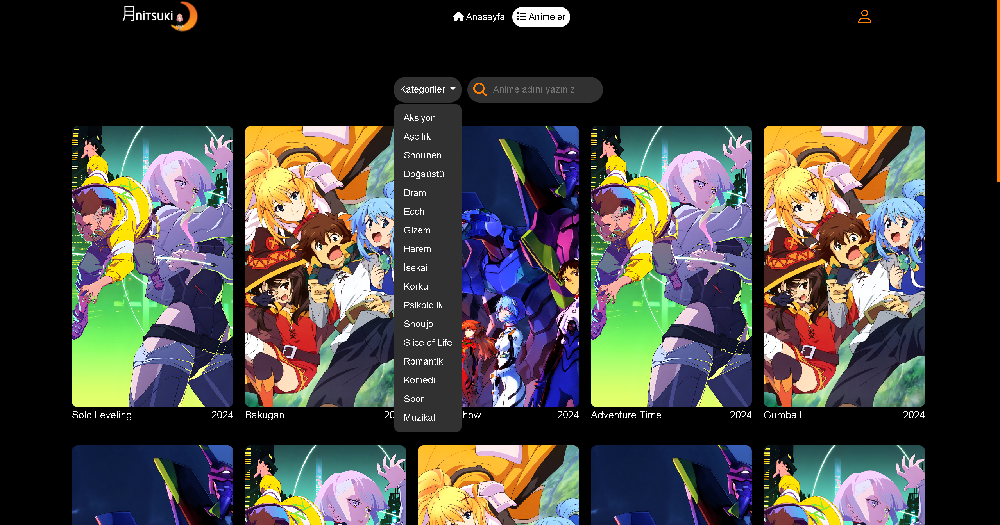
  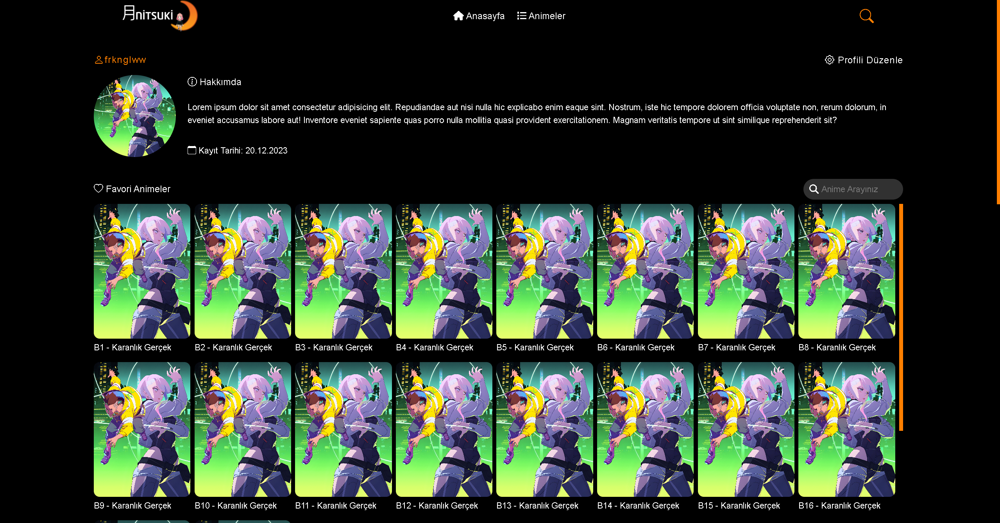
  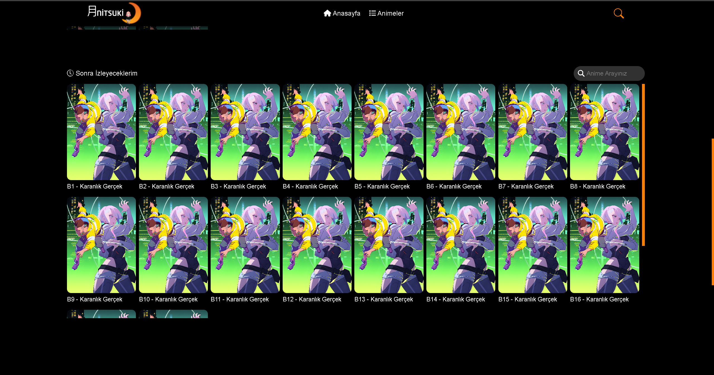
  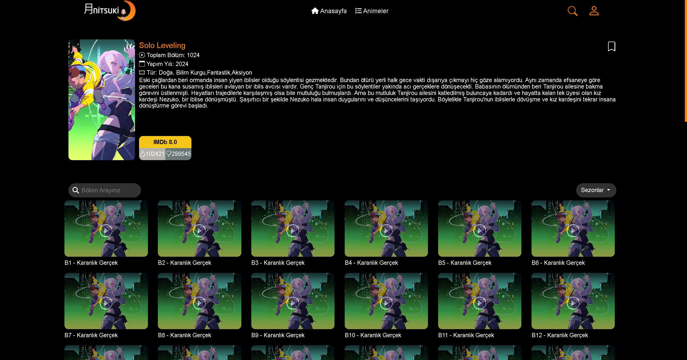
  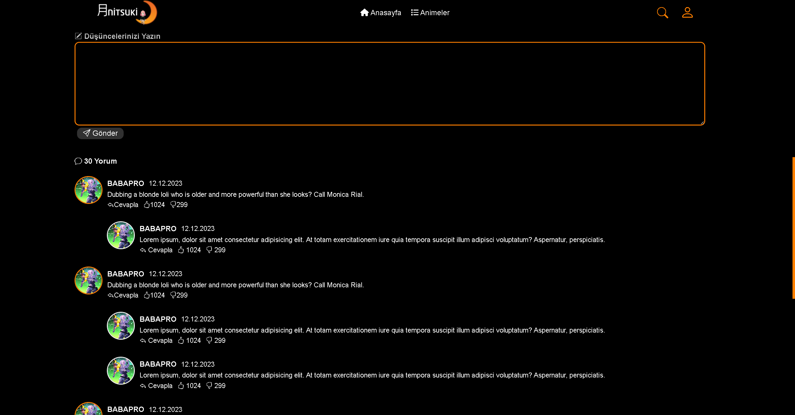
  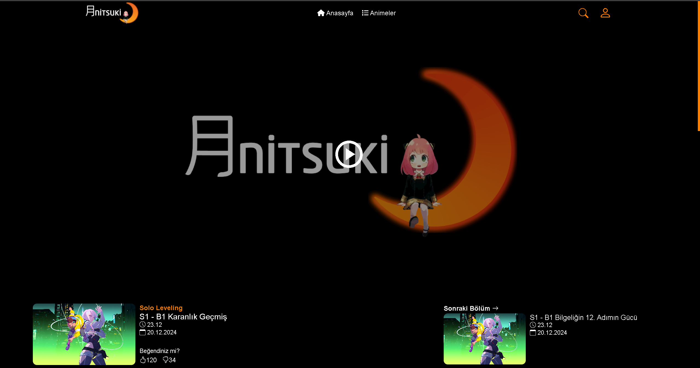
  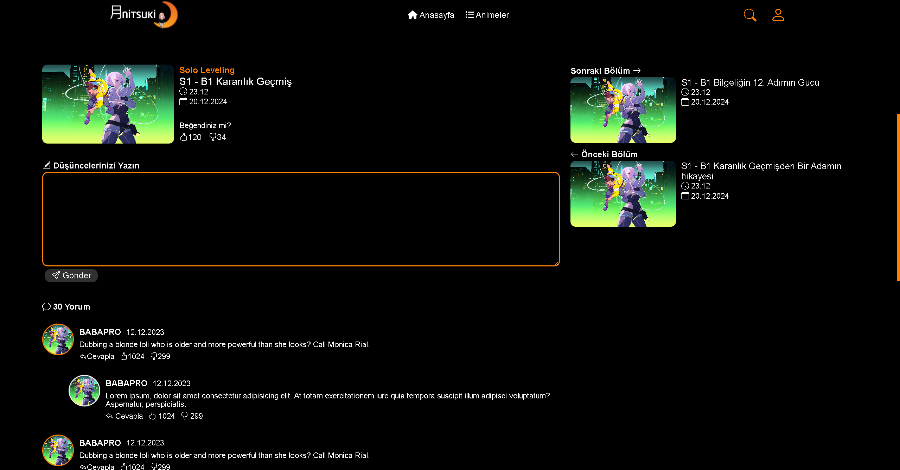
  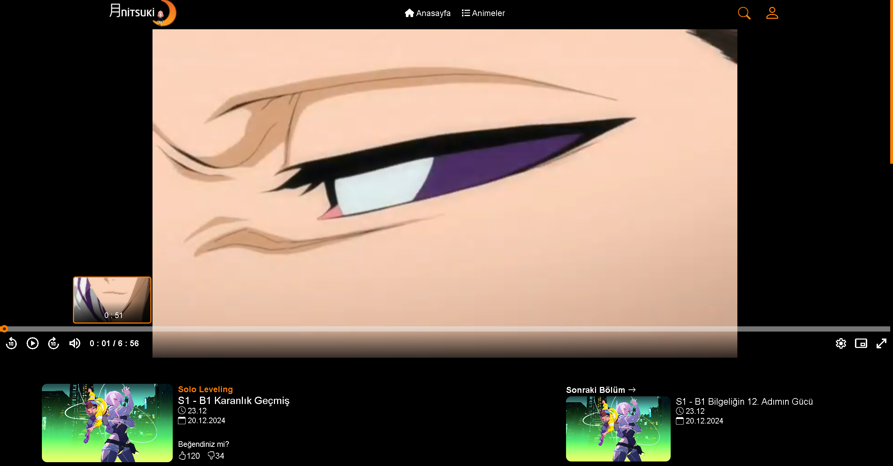
  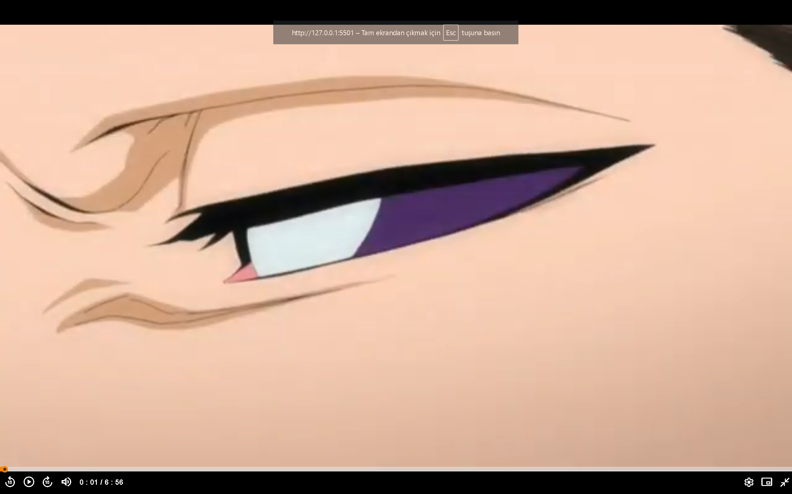

## 📱 Responsive Tasarım & Mobil Uyumluluk

- **Tamamen mobil uyumlu** arayüz  
- Tüm fotoğraflar **responsive** olarak yüklenir  
- Mobil, tablet ve masaüstünde **resimlerde görüldüğü gibi** kusursuz görünüm

  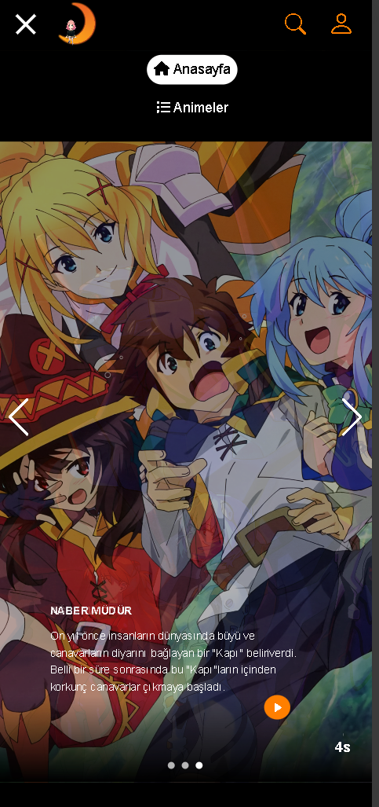
  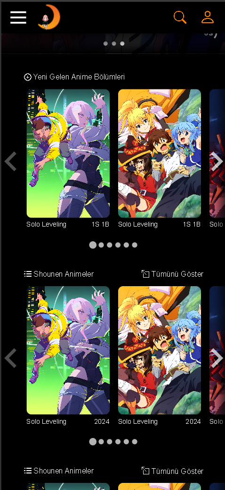
  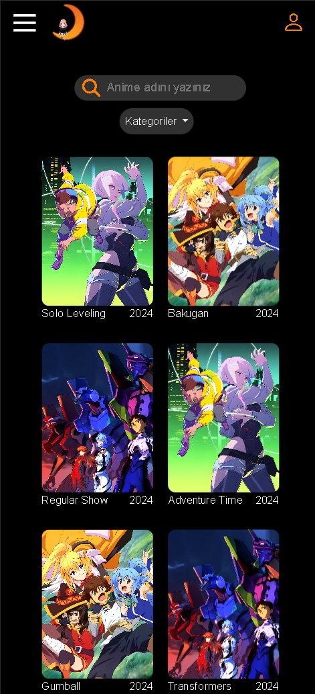
  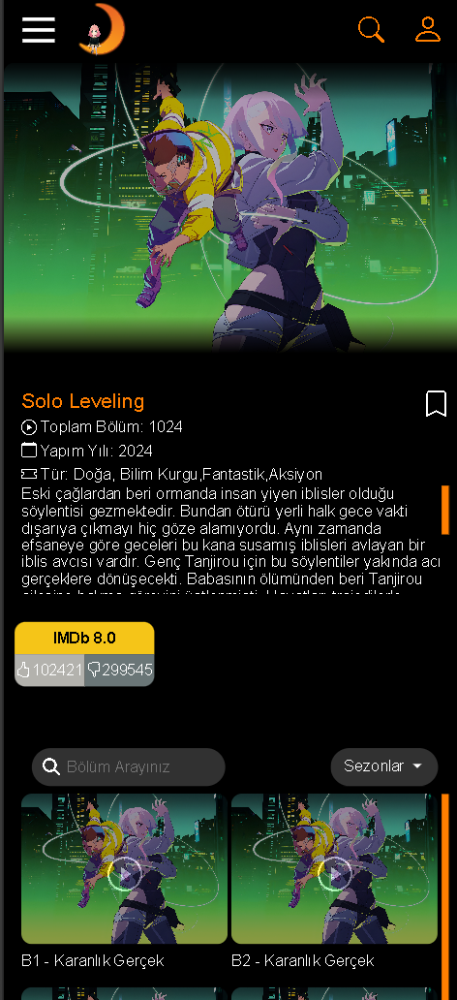
  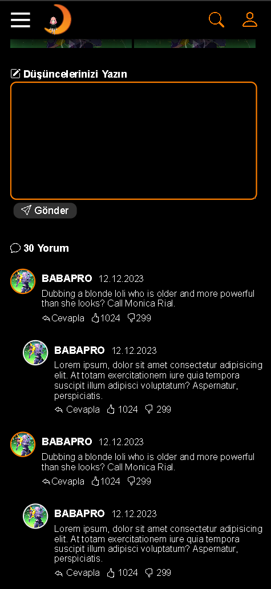
  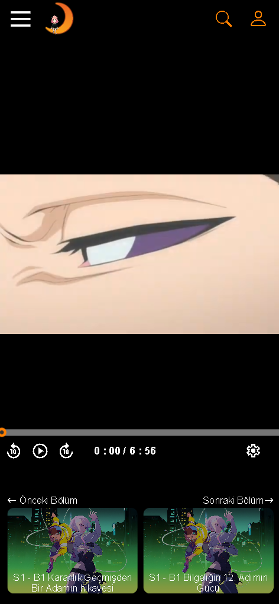

